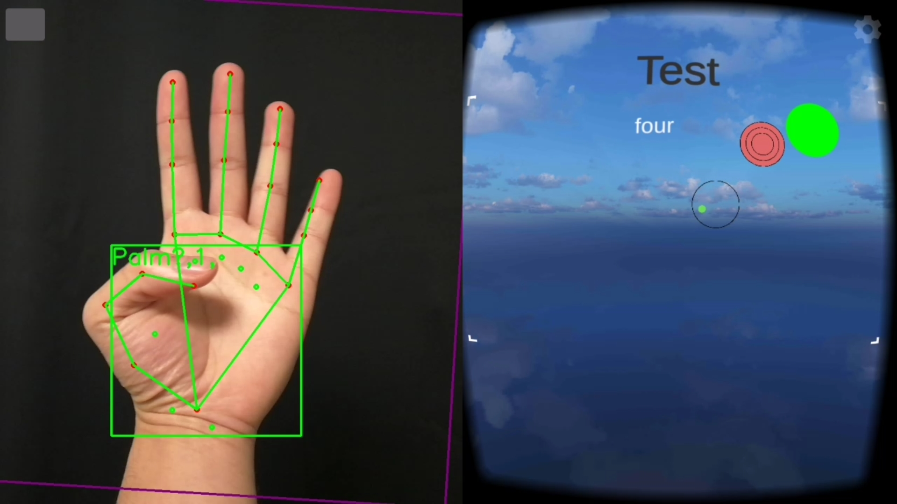
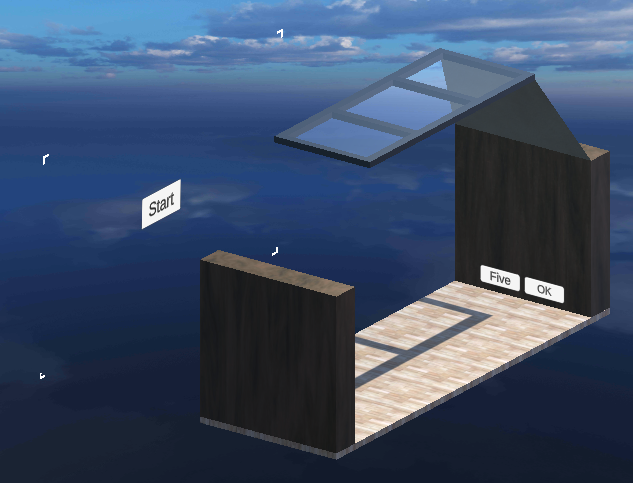
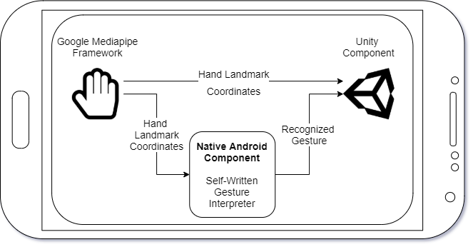

Interact+
===

Interact+ is a mobile VR application that works with Google Cardboard and contains a gesture- and gaze-based target selection approach, which can be used to play the so-called accuracy game, where the user has to aim at targets to destroy them in a limited time. The gesture-based target selection detects hands in camera footage and translate them to gestures.

